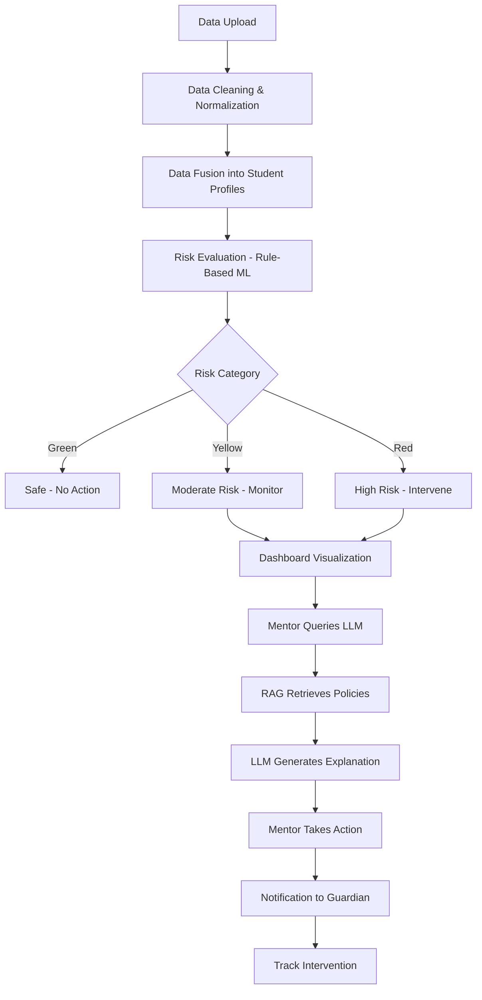

<div align="center">

# 🎓 Academic Early Warning System

**Empowering Institutions Through Proactive Student Success Monitoring**

[](https://opensource.org/licenses/MIT)
[](https://www.postgresql.org/)
[](https://reactjs.org/)
[](https://www.typescriptlang.org/)
[](https://www.python.org/)
[](https://vitejs.dev/)

[Features](#-key-features) • [Architecture](#-system-architecture) • [Installation](#-installation) • [Usage](#-usage) • [Tech Stack](#-technology-stack) • [Contributing](#-contributing)

</div>

---

## 📋 Table of Contents

- [Overview](#-overview)
- [The Problem](#-the-problem)
- [Our Solution](#-our-solution)
- [Key Features](#-key-features)
- [System Architecture](#-system-architecture)
- [Technology Stack](#-technology-stack)
- [Installation](#-installation)
- [Usage](#-usage)
- [Project Structure](#-project-structure)
- [Database Schema](#-database-schema)
- [User Roles](#-user-roles)
- [Workflow](#-workflow)
- [Future Enhancements](#-future-enhancements)
- [Contributing](#-contributing)
- [License](#-license)
- [Acknowledgments](#-acknowledgments)

---

## 🌟 Overview

The **Academic Early Warning System** is an intelligent, explainable dashboard that enables educational institutions to identify at-risk students before it's too late. By integrating **Machine Learning**, **Large Language Models (LLMs)**, **Retrieval-Augmented Generation (RAG)**, and **Cloud-Native Technologies**, this system provides transparent, actionable insights for timely academic intervention.

### 🎯 Project Goals

- **Early Identification**: Detect at-risk students through continuous monitoring of academic indicators
- **Explainability**: Provide transparent, human-readable explanations for risk classifications
- **Human-Centric Design**: Enable mentors and counselors to make informed decisions
- **Scalability**: Deploy using industry-standard containerization and orchestration
- **Low Cost**: Utilize existing institutional data without expensive black-box solutions

---

## 🚨 The Problem

Traditional academic monitoring systems face critical challenges:

### Academic Crisis Statistics
- **40% Dropout Rate**: Nearly half of college students don't complete their degrees
- **43.1 Million Students Affected**: Globally, millions of students struggle without timely support
- **Late Intervention**: Problems are typically identified only after final exams
- **Counselor Shortage**: Average counselor-to-student ratio is 1:385 (vs. recommended 1:250)

### Root Causes
- **Emotional Stress** (52%)
- **Mental Health Issues** (42%)
- **Financial Pressure** (38%)
- **Work Obligations** (30%)
- **Family Issues** (22%)

### Existing System Limitations
- ❌ Manual analysis and static reporting
- ❌ Black-box predictive models lacking transparency
- ❌ High financial investment requirements
- ❌ Delayed identification of struggling students
- ❌ Disconnected data sources

---

## ✨ Our Solution

This project introduces a **transparent, explainable, and scalable** early warning system that:

✅ **Consolidates** attendance, assessment scores, and subject attempt data into unified student profiles  
✅ **Classifies** students into risk categories (🟢 Green, 🟡 Yellow, 🔴 Red) using rule-based ML  
✅ **Explains** risk factors using LLM-powered RAG grounded in institutional policies  
✅ **Visualizes** performance trends with interactive dashboards  
✅ **Notifies** mentors and guardians automatically  
✅ **Deploys** as containerized microservices for production readiness  

### Why This Approach?

| Traditional Systems | Our System |
|---------------------|------------|
| Black-box predictions | Transparent rule-based logic |
| Expensive licensing | Open-source & cost-effective |
| Static reports | Real-time monitoring |
| No explanations | LLM-powered insights |
| Monolithic architecture | Cloud-native microservices |

---

## 🎯 Key Features

### For Teachers & Administrators

<table>
<tr>
<td width="50%">

**📊 Performance Analytics**
- Visual dashboards showing attendance trends
- Assessment score tracking
- Historical performance data

**⚠️ Risk Indicators**
- Color-coded alerts (Green, Yellow, Red)
- Easy identification of at-risk students
- Priority-based student lists

**🔍 Smart Filters**
- Filter by risk level, department, semester
- Custom criteria support
- Drill-down capabilities

</td>
<td width="50%">

**📄 Detailed Reports**
- Comprehensive attendance reports
- Assessment score summaries
- Subject attempt history

**🔔 Automated Alerts**
- Notifications for critical thresholds
- Configurable alert rules
- Multi-channel delivery

**📈 Trend Analysis**
- Intuitive graphs and visualizations
- Time-series performance tracking
- Comparative analytics

</td>
</tr>
</table>

### For Counselors & Mentors

<table>
<tr>
<td width="50%">

**🧠 LLM-Powered Insights**
- AI-generated explanations using RAG
- Intervention recommendations
- Policy-grounded responses

**👥 Student Profiles**
- Consolidated academic data
- Behavioral indicators
- Holistic student view

**💬 Communication Hub**
- Direct messaging with students/guardians
- Follow-up tracking
- Communication history

</td>
<td width="50%">

**🛡️ Privacy & Compliance**
- FERPA-compliant data handling
- Role-based access control
- Audit trail logging

**📖 Institutional Knowledge**
- Vector database of policies
- Best practices retrieval
- Case study library

**🎯 Intervention Tracking**
- Document intervention actions
- Measure effectiveness
- Success rate analytics

</td>
</tr>
</table>

---

## 🏗️ System Architecture

### Architectural Overview

```
┌─────────────────────────────────────────────────────────────────┐
│                         Frontend Layer                          │
│  ┌──────────────────────────────────────────────────────────┐  │
│  │  React + TypeScript + Vite + Tailwind CSS                │  │
│  │  • Hero Dashboard  • Analytics  • Visualizations         │  │
│  │  • Dark Mode  • Responsive Design  • 3D Components       │  │
│  └──────────────────────────────────────────────────────────┘  │
└─────────────────────────────────────────────────────────────────┘
                              ↕ HTTPS/REST API
┌─────────────────────────────────────────────────────────────────┐
│                        Backend Services                         │
│  ┌──────────────┐  ┌──────────────┐  ┌───────────────────┐   │
│  │ Data         │  │ Risk         │  │ LLM Explanation   │   │
│  │ Ingestion    │→ │ Evaluation   │→ │ Service (RAG)     │   │
│  │ Service      │  │ Engine       │  │                   │   │
│  └──────────────┘  └──────────────┘  └───────────────────┘   │
│         ↓                  ↓                    ↑               │
└─────────────────────────────────────────────────────────────────┘
                              ↕
┌─────────────────────────────────────────────────────────────────┐
│                         Data Layer                              │
│  ┌──────────────────┐           ┌─────────────────────────┐   │
│  │  PostgreSQL DB   │           │  Vector Database        │   │
│  │  • Students      │           │  • Policy Embeddings    │   │
│  │  • Attendance    │           │  • Guidelines           │   │
│  │  • Assessments   │           │  • Case Studies         │   │
│  │  • Risk Profiles │           │  • Semantic Search      │   │
│  └──────────────────┘           └─────────────────────────┘   │
└─────────────────────────────────────────────────────────────────┘
                              ↕
┌─────────────────────────────────────────────────────────────────┐
│                    Deployment Layer                             │
│        Docker Containers → Kubernetes Orchestration             │
│        CI/CD Pipeline → Git Version Control                     │
└─────────────────────────────────────────────────────────────────┘
```

### Architecture Benefits

| Benefit | Description |
|---------|-------------|
| **Scalability** | Microservices architecture scales horizontally |
| **Maintainability** | Modular design enables independent updates |
| **Fault Tolerance** | Kubernetes ensures high availability |
| **Deployment Ready** | Containerized for consistent environments |
| **Cost Effective** | Open-source stack reduces licensing costs |

---

## 🛠️ Technology Stack

### Frontend


- **React 19.2** - Modern UI library with concurrent features
- **TypeScript** - Type-safe development
- **Vite** - Lightning-fast build tool and dev server
- **Tailwind CSS 4** - Utility-first CSS framework
- **Recharts** - Composable charting library
- **GSAP** - Professional-grade animations
- **Three.js** - 3D visualizations
- **Lucide Icons** - Beautiful, consistent icons
- **Radix UI** - Accessible component primitives

### Backend


- **Python 3.12+** - Data processing and ML logic
- **PostgreSQL** - Relational database for structured data
- **psycopg2** - PostgreSQL adapter for Python
- **pandas** - Data manipulation and analysis
- **tkinter** - File selection GUI

### Machine Learning & AI
- **Rule-Based ML** - Transparent threshold logic for risk classification
- **Large Language Models (LLMs)** - Natural language explanations
- **Vector Database** - Semantic search for institutional policies
- **RAG (Retrieval-Augmented Generation)** - Grounded, hallucination-free responses

### DevOps & Deployment


- **Docker** - Containerization for consistent deployment
- **Kubernetes** - Container orchestration and scaling
- **Git** - Version control and collaboration
- **CI/CD Pipelines** - Automated testing and deployment

---

## 📦 Installation

### Prerequisites

Ensure you have the following installed:

- **Node.js** (v18+ recommended) - [Download](https://nodejs.org/)
- **Python** (v3.12+) - [Download](https://www.python.org/)
- **PostgreSQL** (v14+) - [Download](https://www.postgresql.org/)
- **Git** - [Download](https://git-scm.com/)

### Step 1: Clone the Repository

```bash
git clone https://github.com/VarunNarayanJain/Emerging-Tools-Technologies.git
cd Emerging-Tools-Technologies
```

### Step 2: Database Setup

```bash
# Start PostgreSQL service (Windows)
# Services → PostgreSQL → Start

# Create database
psql -U postgres
CREATE DATABASE student_warning_db;
\q

# Run schema
psql -U postgres -d student_warning_db -f backend/schema.sql
```

### Step 3: Backend Configuration

```bash
# Update database credentials
# Edit: backend/db/db_connection.py

# Change the following line:
password="YOUR_DB_PASSWORD"  # Replace with your PostgreSQL password
```

### Step 4: Frontend Setup

```bash
cd frontend
npm install
```

### Step 5: Run the Application

```bash
# Terminal 1 - Frontend Development Server
cd frontend
npm run dev
# Access at: http://localhost:5173

# Terminal 2 - Backend Data Ingestion (when needed)
cd backend/ingestion
python assessment_ingestion.py
python attendance_weekly_ingestion.py
python subject_attempt_ingestion.py
```

---

## 🚀 Usage

### 1️⃣ Data Ingestion

Upload student data through the ingestion scripts:

```bash
# Navigate to backend/ingestion
cd backend/ingestion

# Run ingestion scripts
python assessment_ingestion.py      # Upload assessment scores
python attendance_weekly_ingestion.py  # Upload attendance records
python subject_attempt_ingestion.py    # Upload subject attempt data
```

**Expected Excel Format:**

**Attendance**: `student_id` | Date columns (P/A)  
**Assessments**: `student_id` | `assessment_name` | `assessment_type` | `score_obtained` | `max_score` | `assessment_date` | `weightage`  
**Attempts**: `student_id` | `attempts_used` | `max_attempts_allowed` | `last_attempt_date`

### 2️⃣ Risk Evaluation

The system automatically evaluates risk based on:

- **Attendance Risk**: < 75% attendance
- **Performance Risk**: Declining assessment scores
- **Attempt Risk**: Exhausted or near-exhausted attempts

**Risk Categories:**
- 🟢 **Green (Safe)**: All indicators normal
- 🟡 **Yellow (Moderate Risk)**: 1-2 risk factors
- 🔴 **Red (High Risk)**: 3+ risk factors

### 3️⃣ Dashboard Navigation

1. **Hero Section**: Overview and key statistics
2. **About**: System mission and objectives
3. **Features**: Detailed feature breakdown by user role
4. **Workflow**: System process visualization
5. **Technology**: Tech stack carousel

### 4️⃣ Query LLM for Explanations

*(To be implemented)*

Mentors can ask:
- "Why is student X at high risk?"
- "What interventions are recommended?"
- "Show historical cases similar to this profile."

The system retrieves relevant institutional policies from the Vector Database and generates contextual responses using RAG.

---

## 📂 Project Structure

```
Emerging-Tools-Technologies/
├── 📁 backend/
│   ├── 📁 db/
│   │   └── db_connection.py          # PostgreSQL connection handler
│   ├── 📁 ingestion/
│   │   ├── assessment_ingestion.py   # Upload assessment scores
│   │   ├── attendance_weekly_ingestion.py  # Upload attendance data
│   │   └── subject_attempt_ingestion.py    # Upload attempt records
│   └── schema.sql                    # Complete database schema
│
├── 📁 frontend/
│   ├── 📁 public/                    # Static assets (images, icons)
│   ├── 📁 src/
│   │   ├── 📁 components/
│   │   │   ├── 📁 layout/
│   │   │   │   ├── Header.tsx        # Navigation header
│   │   │   │   └── Footer.tsx        # Site footer
│   │   │   ├── 📁 sections/
│   │   │   │   ├── Hero.tsx          # Hero section with stats
│   │   │   │   ├── About.tsx         # System overview
│   │   │   │   ├── Features.tsx      # Feature showcase
│   │   │   │   └── WorkFlow.tsx      # System workflow
│   │   │   └── 📁 ui/                # Reusable UI components
│   │   │       ├── 3d-card.tsx       # 3D card effects
│   │   │       ├── CountUp.tsx       # Animated counters
│   │   │       ├── DataSphereBooks3D.tsx  # 3D visualizations
│   │   │       ├── DeCharts.tsx      # Data charts
│   │   │       ├── EduAlertCard.tsx  # Educational cards
│   │   │       └── ThemeToggle.tsx   # Dark mode toggle
│   │   ├── 📁 context/
│   │   │   ├── theme-context.tsx     # Theme state management
│   │   │   ├── theme-provider.tsx    # Theme provider
│   │   │   └── useTheme.ts           # Theme hook
│   │   ├── 📁 lib/
│   │   │   └── utils.ts              # Utility functions
│   │   ├── App.tsx                   # Main application component
│   │   ├── main.tsx                  # Application entry point
│   │   └── index.css                 # Global styles
│   ├── package.json                  # Frontend dependencies
│   ├── vite.config.ts                # Vite configuration
│   ├── tsconfig.json                 # TypeScript configuration
│   └── tailwind.config.js            # Tailwind CSS configuration
│
└── README.md                         # This file
```

---

## 🗄️ Database Schema

### Core Tables

#### **students**
Stores student demographic and enrollment information.

```sql
student_id (PK) | roll_number | full_name | class | section | 
department | enrollment_year | status | created_at | updated_at
```

#### **attendance_records**
Tracks attendance across subjects and time periods.

```sql
attendance_id (PK) | student_id (FK) | subject_code | 
period_start | period_end | classes_conducted | 
classes_attended | attendance_percentage | recorded_at
```

#### **assessment_records**
Stores assessment scores and metadata.

```sql
assessment_id (PK) | student_id (FK) | subject_code | 
assessment_name | assessment_type | score_obtained | 
max_score | assessment_date | weightage | recorded_at
```

#### **subject_attempts**
Monitors subject attempt counts.

```sql
attempt_id (PK) | student_id (FK) | subject_code | 
attempts_used | max_attempts_allowed | last_attempt_date | status
```

#### **risk_profiles**
Consolidated risk assessment for each student.

```sql
risk_profile_id (PK) | student_id (FK) | attendance_risk | 
performance_risk | attempt_risk | fee_risk | risk_score | 
risk_category | last_evaluated_at
```

#### **notification_logs**
Tracks all sent notifications.

```sql
notification_id (PK) | student_id (FK) | recipient_type | 
risk_category | message_summary | sent_at | delivery_status
```

### Relationship Diagram

```
students (1) ──< (M) attendance_records
students (1) ──< (M) assessment_records
students (1) ──< (M) subject_attempts
students (1) ──< (1) risk_profiles
students (1) ──< (M) notification_logs
```

---

## 👥 User Roles

### 🔧 Administrator
- Upload and synchronize data sources
- Manage user accounts and permissions
- Configure risk thresholds and rules
- Monitor system health and performance

### 👨‍🏫 Teacher / Mentor
- View risk indicators and student lists
- Access performance analytics and trends
- Filter and drill down into student profiles
- Receive automated alerts for critical cases

### 🧑‍⚕️ Counselor
- Query LLM for risk explanations
- Access intervention recommendations
- Document counseling sessions
- Track intervention effectiveness

### 👪 Guardian (Optional)
- Receive alert notifications
- View student performance summary
- Contact mentors and counselors

---

## 🔄 Workflow

### System Process Flow



### Step-by-Step Process

1. **📤 Data Ingestion**
   - Upload attendance, assessment, and attempt data
   - System validates and cleans data
   - Records normalized into unified format

2. **🔗 Data Fusion**
   - Merge all records by `student_id`
   - Create comprehensive student profiles
   - Calculate aggregate metrics

3. **🤖 Risk Identification**
   - Apply rule-based ML thresholds:
     - Attendance < 75% → Attendance Risk
     - Score decline > 15% → Performance Risk
     - Attempts ≥ Max → Attempt Risk
   - Calculate risk score (0-100)
   - Classify into Green/Yellow/Red

4. **📊 Visualization**
   - Dashboard displays color-coded student lists
   - Charts show trends and distributions
   - Filters enable drill-down analysis

5. **🧠 LLM Explanation**
   - Mentor queries: "Why is this student at risk?"
   - System retrieves relevant policies via Vector DB
   - LLM generates grounded, policy-compliant explanation
   - Suggests intervention strategies

6. **🔔 Notifications**
   - Automated alerts sent to mentors
   - Guardian notifications for high-risk students
   - Configurable frequency and channels

---

## 🔮 Future Enhancements

### Planned Features

- [ ] **LMS Integration** - Connect with Moodle, Canvas, Blackboard
- [ ] **Predictive Analytics** - LSTM models for trend forecasting
- [ ] **Mobile Application** - Native iOS/Android apps for mentors
- [ ] **Real-Time Data Ingestion** - Live synchronization with institutional systems
- [ ] **Advanced RAG** - Fine-tuned embeddings for institutional knowledge
- [ ] **Intervention Tracking** - Measure success rates of interventions
- [ ] **Parent Portal** - Dedicated dashboard for guardians
- [ ] **Multi-Language Support** - Internationalization (i18n)
- [ ] **API Gateway** - RESTful API for third-party integrations
- [ ] **Advanced Analytics** - Cohort analysis, A/B testing
- [ ] **Chatbot Interface** - Conversational AI for queries
- [ ] **Privacy Dashboard** - GDPR/FERPA compliance tools

### Research Opportunities

- Fine-tuning LLMs on educational datasets
- Explainable AI (XAI) for risk predictions
- Federated learning for multi-institutional models
- Fairness and bias detection in risk scoring

---

## 🤝 Contributing

We welcome contributions from the community! Here's how you can help:

### How to Contribute

1. **Fork the Repository**
   ```bash
   git clone https://github.com/VarunNarayanJain/Emerging-Tools-Technologies.git
   cd Emerging-Tools-Technologies
   git checkout -b feature/your-feature-name
   ```

2. **Make Your Changes**
   - Follow existing code style
   - Add comments and documentation
   - Write meaningful commit messages

3. **Test Your Changes**
   ```bash
   # Frontend
   cd frontend
   npm run build
   npm run lint
   
   # Backend
   python -m pytest tests/
   ```

4. **Submit a Pull Request**
   - Describe your changes clearly
   - Reference any related issues
   - Wait for code review

### Contribution Guidelines

- ✅ Write clear, concise code
- ✅ Follow TypeScript/Python best practices
- ✅ Add unit tests for new features
- ✅ Update documentation as needed
- ✅ Be respectful and collaborative

### Areas Needing Help

- 🐛 Bug fixes and performance improvements
- 📚 Documentation enhancements
- 🎨 UI/UX design refinements
- 🧪 Test coverage expansion
- 🌐 Internationalization (i18n)

---

## 📄 License

This project is licensed under the **MIT License** - see the [LICENSE](LICENSE) file for details.

```
MIT License

Copyright (c) 2026 Varun Narayan Jain

Permission is hereby granted, free of charge, to any person obtaining a copy
of this software and associated documentation files (the "Software"), to deal
in the Software without restriction, including without limitation the rights
to use, copy, modify, merge, publish, distribute, sublicense, and/or sell
copies of the Software, and to permit persons to whom the Software is
furnished to do so, subject to the following conditions:

The above copyright notice and this permission notice shall be included in all
copies or substantial portions of the Software.
```

---

## 🙏 Acknowledgments

### Inspiration & Research

- **National Center for Education Statistics** - Dropout rate data
- **American School Counselor Association** - Counselor ratio standards
- **Research Papers** on early warning systems in education
- **Open Source Community** - For amazing tools and libraries

### Technologies & Libraries

- [React](https://reactjs.org/) - UI library
- [PostgreSQL](https://www.postgresql.org/) - Database
- [Vite](https://vitejs.dev/) - Build tool
- [Tailwind CSS](https://tailwindcss.com/) - Styling
- [GSAP](https://greensock.com/gsap/) - Animations
- [Recharts](https://recharts.org/) - Charting
- [Three.js](https://threejs.org/) - 3D graphics

### Special Thanks

- **Educational Institutions** - For highlighting the need for such systems
- **Beta Testers** - For valuable feedback
- **Contributors** - For improving the project

---

## 📞 Contact & Support

### Project Maintainer

**Varun Narayan Jain**  
GitHub: [@VarunNarayanJain](https://github.com/VarunNarayanJain)  
Repository: [Emerging-Tools-Technologies](https://github.com/VarunNarayanJain/Emerging-Tools-Technologies)

### Get Help

- 🐛 **Bug Reports**: [Open an Issue](https://github.com/VarunNarayanJain/Emerging-Tools-Technologies/issues)
- 💡 **Feature Requests**: [Start a Discussion](https://github.com/VarunNarayanJain/Emerging-Tools-Technologies/discussions)
- 📖 **Documentation**: [Wiki](https://github.com/VarunNarayanJain/Emerging-Tools-Technologies/wiki)

---

## 📊 Project Status


**Current Version**: 1.0.0 (Beta)  
**Last Updated**: February 2, 2026  
**Status**: Active Development 🚀

---

<div align="center">

### ⭐ Star this repository if you find it helpful!

**Made with ❤️ for Educational Excellence**

[Back to Top](#-academic-early-warning-system)

</div>
